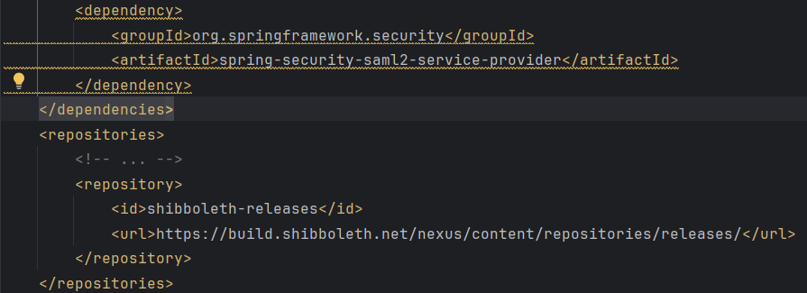

# Okta_SSO
1. Create account on Okta **https://okta-devok12.okta.com/signin/register**.
2. ****
3. This is must add Dependency in **[pom.xml]()**
4. After Creating A account on Okta Now Register a App and Download it Certificate and Create **`metadata-idp-okta.xml`**.
5. Do Configuration in **`application.yml`**.
6. For role Base Authorization 1. create Group in Okta Assign Person for that group. Assign that Group to App. **and** remember that also have assign user to app (means same user assign with group and directly to app.).
7. Now Edit Okta app's SAML settings and fill in the **Group Attribute Statements**
   **`section.Name: groups`** **`Name format: Unspecified`** **`Filter: Matches regex and use .*`** for the value.
8. Now Spring **SecurityConfig** [SecurityConfig.java](****). we have to use Converter for this.
9. SecurityConfig Reference Link **https://developer.okta.com/code/java/spring_security_saml/**.